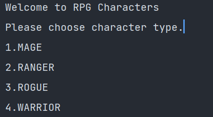

# Summary

This application implements RPG Character game on a command line.

The user is able to select a character and perform various actions. Actions like levelup and create an item.

## Dependencies

Java JDK 17.0.1 JUnit 5 for testing

## How to use

Start the game by running the Main class in editor.

## Author

Alex On

<div id="top"></div>
<!--
*** Thanks for checking out the Best-README-Template. If you have a suggestion
*** that would make this better, please fork the repo and create a pull request
*** or simply open an issue with the tag "enhancement".
*** Don't forget to give the project a star!
*** Thanks again! Now go create something AMAZING! :D
-->


<!-- PROJECT SHIELDS -->
<!--
*** I'm using markdown "reference style" links for readability.
*** Reference links are enclosed in brackets [ ] instead of parentheses ( ).
*** See the bottom of this document for the declaration of the reference variables
*** for contributors-url, forks-url, etc. This is an optional, concise syntax you may use.
*** https://www.markdownguide.org/basic-syntax/#reference-style-links
-->

[![LinkedIn][linkedin-shield]][linkedin-url]


<!-- PROJECT LOGO -->
<br />
<div align="center">
  <a href="https://github.com/othneildrew/Best-README-Template">
    
  </a>


  <p align="center">
    RPG Characters
    <br />
    <a href="">View Demo</a>
  </p>
</div>


<!-- TABLE OF CONTENTS -->

  <summary>Table of Contents</summary>
  <ol>
    <li>
      <a href="#about-the-project">About The Project</a>
      <ul>
        <li><a href="#built-with">Built With</a></li>
      </ul>
    </li>
    <li>
      <a href="#getting-started">Getting Started</a>
      <ul>
        <li><a href="#prerequisites">Prerequisites</a></li>
        <li><a href="#installation">Installation</a></li>
      </ul>
    </li>
    <li><a href="#usage">Usage</a></li>
    <li><a href="#roadmap">Roadmap</a></li>
    <li><a href="#contact">Contact</a></li>
    <li><a href="#acknowledgments">Acknowledgments</a></li>
  </ol>


<!-- ABOUT THE PROJECT -->

## About The Project

This project is part of an assignment in the Java fullstack course and covers how to create a java command line
application.

### This application implements the following features

* LEVEL_UP - level up character
* PRINT_STATS - prints characters stats
* CREATE_ITEM - used to create an item
* LIST_INVENTORY - lists character inventory
* RESTART_GAME - restarts the game
* END_GAME - ends the game

[![Product Name Screen Shot][product-screenshot]](https://github.com/shuhia/rpg-characters)


<p align="right">(<a href="#top">back to top</a>)</p>

### Built With

* Java JDK 17
* JUnit 5.8

<p align="right">(<a href="#top">back to top</a>)</p>


<!-- GETTING STARTED -->

## Getting Started

Instructions for how to setup the project

### Prerequisites

Java JDK 17

### Installation

#### Instruction for Intellij IDE

1.Clone the repo

   ```sh
   git clone https://github.com/shuhia/rpg-characters.git
   ```

2.Install java dependencies listed


<!-- USAGE EXAMPLES -->

## Usage

### Starting the program

1. Start Main class.

### Using the command line

After starting main follow the instructions from the command line.


<!-- ROADMAP -->

## Roadmap

- [x] Add command client
- [x] Add characters
- [x] Add items
- [x] Add unit tests for items
- [x] Add unit tests for characters

See the [open issues](https://github.com/shuhia/rpg-characters/issues) for a full list of proposed features (
and known issues).


<!-- CONTACT -->

## Contact

Project Link: [https://github.com/shuhia/rpg-characters](https://github.com/shuhia/rpg-characters)

<!-- ACKNOWLEDGMENTS -->

## Acknowledgments

Noroff LMS provided assignment: [link to pdf](./Assignment 1_Java_RPGCharacters.pdf)

<!-- MARKDOWN LINKS & IMAGES -->
<!-- https://www.markdownguide.org/basic-syntax/#reference-style-links -->

[linkedin-shield]: https://img.shields.io/badge/-LinkedIn-black.svg?style=for-the-badge&logo=linkedin&colorB=555

[linkedin-url]: https://www.linkedin.com/in/alex-on-0a08b8107/

[product-screenshot]: rpg-characters-main-menu.PNG